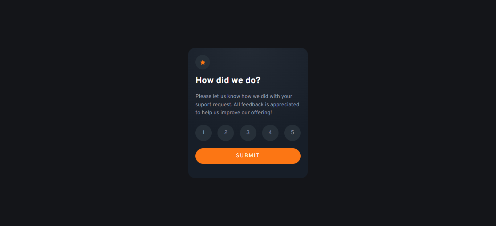

# Frontend Mentor - Interactive rating component solution

This is a solution to the [Interactive rating component challenge on Frontend Mentor](https://www.frontendmentor.io/challenges/interactive-rating-component-koxpeBUmI). Frontend Mentor challenges help you improve your coding skills by building realistic projects.

## Table of contents

- [Overview](#overview)
  - [The challenge](#the-challenge)
  - [Screenshot](#screenshot)
  - [Links](#links)
- [My process](#my-process)
  - [Built with](#built-with)
  - [What I learned](#what-i-learned)
  - [Continued development](#continued-development)
  - [Useful resources](#useful-resources)
- [Author](#author)

## Overview

### The challenge

Users should be able to:

- View the optimal layout for the app depending on their device's screen size
- See hover states for all interactive elements on the page
- Select and submit a number rating
- See the "Thank you" card state after submitting a rating

### Screenshot



### Links

- Solution URL: [https://github.com/LeonardoR3D/frontend-mentor-challenge-002.git]
- Live Site URL: [https://leonardor3d.github.io/frontend-mentor-challenge-002/]

## My process

### Built with

- HTML5
- CSS custom properties
- Flexbox

### What I learned

I learned how to control svg, both as images and objects in the html file.

```html
<div class="icon-star">
  <svg viewBox="0 0 16 16">
    <path
      d="m 8.663139,0.43 1.901356,4.031 c 0.107011,0.228 0.3153,0.386 0.554164,0.422 l 4.251776,0.647 a 0.73761144,0.772 0 0 1 0.407979,1.316 l -3.076566,3.138 a 0.73856689,0.773 0 0 0 -0.212111,0.683 l 0.726146,4.431 a 0.73761144,0.772 0 0 1 -1.07011,0.813 L 8.3430615,13.819 a 0.73856689,0.773 0 0 0 -0.6860169,0 L 3.8543328,15.911 A 0.73761144,0.772 0 0 1 2.7851784,15.098 l 0.726146,-4.431 A 0.73570053,0.77 0 0 0 3.2992133,9.984 L 0.22264749,6.846 A 0.73761144,0.772 0 0 1 0.63158233,5.53 L 4.8824026,4.883 A 0.73761144,0.772 0 0 0 5.4365667,4.461 L 7.3379226,0.43 a 0.73952235,0.774 0 0 1 1.3252164,0 z"
    />
  </svg>
</div>

```

I learned how to correctly use gradients as background colors.

```css
.card {
  background-image: radial-gradient(
    circle farthest-side at 50% 0%,
    var(--color-card-gradient-01),
    var(--color-card-gradient-02) 75%
  );
}
```

I learned how to select multiple objects in the DOM and assign them an event listener that triggers a function that uses the contents of each object once they are clicked.

```js
let rating = 0;
const ratingButtons = document.querySelectorAll(".btn-rating");
function setRating(event) {
  rating = event.target.textContent;
}
ratingButtons.forEach((btn) => {
  btn.addEventListener("click", setRating);
});
```

### Continued development

I want to learn more about HTML 5 semantic tags, object-oriented CSS and JavaScript in general, because I think I can improve.

### Useful resources

- [CSS Gradient](https://cssgradient.io/) - Here I learned the enormous variety of things I can do using gradients.
- [SVG Explained in 100 Seconds](https://youtu.be/emFMHH2Bfvo) - The best explanation about SVG that i have seen until today.

## Author

- Frontend Mentor - [@LeonardoR3D](https://www.frontendmentor.io/profile/LeonardoR3D)
- Twitter - [@Crazy9_3D](https://twitter.com/Crazy9_3D)
